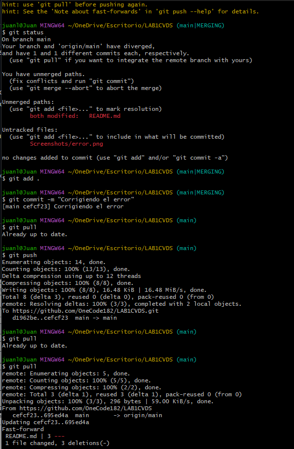
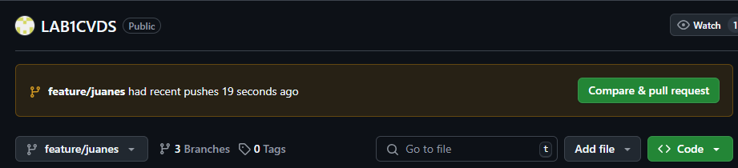

# CVDS G03 Laboratorio #1 INTRODUCCION A GIT

### Integrantes
- Sergio Andrey Silva
- Juan Esteban Lozano 


### Respuestas
## PARTE I (Trabajo Individual). 

### 1. Crea un repositorio localmente.

Elegir incialmente el directorio donde estara el respositorio, en este caso, se hara en el *Escritorio*

Se usa *Shift + Clic Derecho*, y en la opcion de la terminal Bash de Git (Git Bash) en la opcion *Open Git Bash here*


A continuacion se crea la carpeta llamada `Lab1CVDS`, luego se entra alli, y se inicializa el repositorio local con el comando: 

```
git init
```


### 2. Agrega un archivo de ejemplo al repositorio, el **README.md** puede ser una gran opción.

Para agregar el archivo `README.MD`, se usa:

```
echo "LAB1 README FILE !!!" > README.md
```
El comando echo junto a la cadena de texto funciona para crear un archivo con dicho contenido.

### 3. Averigua para qué sirve y como se usan estos comandos git add y git commit -m “mensaje”

- `git add`: Git Add toma tus archivos modificados y los coloca en el área de preparación, 
también conocida simplemente como "el índice". Esta área de almacenamiento provisional es 
un estado intermedio. Los archivos permanecen almacenados provisionalmente hasta que se 
confirman. Sin este paso, Git no sabrá qué cambios tienes la intención de incluir en tu 
próxima confirmación.

  Este comando prepara todos los archivos modificados, excluyendo los ignorados por *.gitignore*. Internamente 
  Git está creando una lista de cambios (un registro de contenido nuevo y líneas eliminadas) que serán 
  incluido en la siguiente confirmación. Piense en ello como organizar los papeles en su escritorio antes de colocarlos 
  en una carpeta. El área de preparación garantiza que tenga control sobre lo que entra en cada uno 
  instantánea, lo que le permite dividir los cambios en fragmentos significativos y mantener una imagen limpia 
  Historial de confirmaciones.

- `git commit`: Después de preparar los cambios con git add, el siguiente paso es git commit. La 
  ejecución de git commit transforma lo que hay en el área de preparación en una instantánea 
  inmutable almacenada en el historial del repositorio de Git. A cada confirmación se le asigna 
  un hash único (una suma de comprobación criptográfica) para identificarla. Este hash es
  básicamente un ID vinculado a esa versión exacta de sus archivos.

[Referencia-graphite.dev](https://graphite.dev/guides/git-add-commit-push)


### 4. Abre una cuenta de github, si ya la tienes, enlazala con el correo institucional.

Actualmente ya tenia una cuenta con nombre de usuario [OneCode182](https://github.com/OneCode182)

Hice la configuracion y vincule mi correo institucional *sergio.silva-r@mail.escuelaing.edu.co*


### 5. Crea un repositorio en blanco (vacío) e GitHub.


### 6. Configura el repositorio local con el repositorio remoto.

Para realizar la vinculacion, se usa el comando

```
git remote add origin "LINK"
```


### 7. Sube los cambios, teniendo en cuenta lo que averiguaste en el punto3


### 8. Configura el correo en git local de manera correcta

Para configurar el nombre:

```
git config --global user.name "NAME"
```

Para configurar el correo:

```
git config --global user.email "EMAIL"
```

Verificando la configuracion:


### 9. Vuelve a subir los cambios y observa que todo esté bien en el repositorio remoto (en GitHub).

## Inicio de la segunda parte

### Primer punto
Owner: Sergio Silva
Collaborator: Juan Lozano

### Segundo punto
EL owner realizo la incitación que se acepto.


### Tercer punto
Se acepto la incitación por correo

### Cuato punto
Se acepto y se unio al repositorio


### Quinto punto
Se unio el Collaborator al repositorio y se edita al mismo tiempo

### Sexto punto
AL editar al mismo tiempo paso que 

### Septimo punto
Hubo conflicto al subir cambios al tiempo entre el *Owner* y el *Collaborator*, git detecto cambios inusuales y por ende creo una rama aparte de main.

- RAMA EN CONSOLA: Main\MERGING

#### Como se soluciono?
Se hizo un `git status` para ver el estado del repositorio, a lo cual mostro lo siguiente:


El motor de git recomenda hacer:

```
git merge --abort
```

Y con ese comando, se soluciono el problema

### OCtavo punto
Se volvio a realizar un cambio simultaneo donde volvio a realizar el error


### Noveno punto

CONFLICTO SERGIO

Se resolvio con consolva y sus respectivos comandos:



## Inicio de la tercera parte 
### Primer punto
¿Hay una mejor forma de trabajar con git para no tener conflictos?

RTA: Una mejor forma para trabajar y evitar la mayoria de los conflictos es la creacion de ramas lo cual nos evita trabajar sobre la rama principal la cual es main o master dando así una mejor resolucion de conflictos

### Segundo punto
¿Qué es y como funciona el Pull Request?

RTA: Un Pull Request (PR) es una funcionalidad clave en sistemas de control de versiones como Git que permite colaborar en proyectos de software. Es una forma de notificar a otros desarrolladores que tienes cambios listos para ser revisados e integrados en la rama principal o en cualquier otra rama.

### Tercer punto

Parte Owner


Parte Collaborator


### Cuarto punto
Cambio del Collaborator:

Ejemplo de trabajo en la ramana del Collaborator para subir despues el cambio y juntar las ramas .


### Quinto punto
Ya se juntaron las ramas